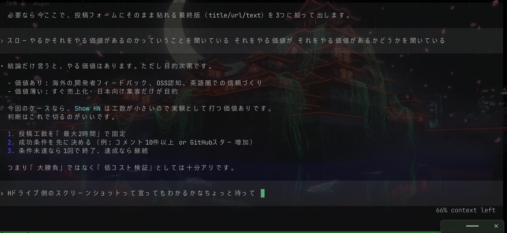

<div align="center">

# multi-agent-shognate

**tmux 運用と Android リモート操作に寄せた、portable な multi-agent-shogun fork。**

[](https://github.com/TsukinowaRin/multi-agent-shognate)
[](https://opensource.org/licenses/MIT)
[]()

[English](README.md) | [日本語](README_ja.md)

</div>

<p align="center">
  
</p>

## このリポジトリは何か

`multi-agent-shognate` は [`multi-agent-shogun`](https://github.com/yohey-w/multi-agent-shogun) を元にした fork で、upstream の発想は維持しつつ、実運用の前提をこのリポジトリ向けに変えています。

この fork が重視しているのは次です。

- `tmux` 中心の運用
- 任意のフォルダへそのまま入れられる portable インストール
- fork 版 APK を使った Android リモート操作
- upstream より広い Multi-CLI 対応
- 保守寄りの既定構成: 全役職 `codex`、`model: auto`、初期足軽は `ashigaru1` / `ashigaru2` の2名

要点だけ言うと、

- 将軍システムを使いたいフォルダに入れる
- `shutsujin_departure.sh` を起動する
- 将軍へ自然言語で命令する
- 家老が意図から人数配分と並列度を判断する

という運用です。

## upstream と何が違うか

| 項目 | upstream | この fork |
|---|---|---|
| runtime 構成 | split tmux session が主 | `goza-no-ma:overview` が runtime 正本。`shogun` / `gunshi` / `multiagent` は Android 互換 proxy として維持 |
| 初期足軽構成 | 歴史的に大きい編成を前提にした記述がある | 既定の現役足軽は `ashigaru1` と `ashigaru2` のみ |
| 既定 CLI | upstream 既定 | 全役職 `codex`、`model: auto` |
| CLI 対応範囲 | upstream の中核 CLI | `Gemini CLI`、`OpenCode`、`Kilo`、`localapi`、`Ollama` / `LM Studio` 連携を追加 |
| Android 配布 | upstream Android アプリ / APK | この repo の Releases にある fork 版 APK を正規配布物として扱う |
| Windows installer | repo 前提の導線 | Releases の `multi-agent-shognate-installer.bat` を配布し、置いたフォルダへ portable に導入 |
| 家老の動き | 指示に応じて分担 | この fork では、家老が意図から自律的に人数・分担・並列度を決めることを明示 |

## 基本モデル

指揮系統そのものは Shogun 方式です。

```text
あなた
 -> 将軍
 -> 家老
 -> 足軽 / 軍師
```

この fork で特に重要なのは次です。

- 現役兵力は `topology.active_ashigaru` を正本とする
- `ashigaru1..8` の歴史的記述は、そのまま現役人数とはみなさない
- 家老は、現在の active roster と命令内容から編成を適応的に決める

## 対応 CLI とベンダー

この fork は特定ベンダー前提ではありません。

### 対応している agent CLI type

| CLI type | 想定ベンダー / backend | 補足 |
|---|---|---|
| `codex` | OpenAI Codex CLI | この fork の既定 |
| `claude` | Anthropic Claude Code | upstream 同様に対応 |
| `copilot` | GitHub Copilot CLI | upstream 同様に対応 |
| `kimi` | Kimi Code | upstream 同様に対応 |
| `gemini` | Gemini CLI | この fork で明示対応 |
| `opencode` | OpenCode CLI | この fork で追加 |
| `kilo` | Kilo CLI | この fork で追加 |
| `localapi` | OpenAI 互換 local endpoint | `Ollama` / `LM Studio` / llama.cpp server など向け |

### 既定の権限 / 承認方針

この fork では、全エージェントが既定で「承認確認を挟まない」側に寄るようにしてあります。

| CLI type | 既定の unattended 方針 |
|---|---|
| `claude` | `--dangerously-skip-permissions` |
| `codex` | `--dangerously-bypass-approvals-and-sandbox` |
| `copilot` | `--yolo` |
| `kimi` | `--yolo` |
| `gemini` | `--yolo` |
| `opencode` | 生成される `opencode.json` に `permission: allow` を入れる |
| `kilo` | 生成される `opencode.json` に `permission: allow` を入れる |
| `localapi` | 別の承認レイヤーを持たず、local REPL を直接起動する |

特に `Codex` については、各役職を repo-local の別 `CODEX_HOME` で起動するようにしてあります。これにより、将軍側で選んだ model や `reasoning_effort` が、VSCode の Codex や無関係な別 Codex CLI セッションへ漏れにくくなります。

### local provider 対応

`localapi` は、ローカルまたは self-hosted な provider を Shogunate に載せるための入口です。具体的には次を想定しています。

- `Ollama`
- `LM Studio`
- llama.cpp server
- OpenAI 互換 API を出す local endpoint

任意のローカルモデルを主目的で使うなら、まず `localapi` を使ってください。
この fork では、次の用途の主経路を `localapi` と位置付けます。

- LM Studio 上の独自 model ID をそのまま使いたい
- Ollama の local model を素直につなぎたい
- llama.cpp など OpenAI 互換 endpoint を直接叩きたい
- OpenCode / Kilo の内蔵 provider registry に載っていない backend を使いたい

`opencode` / `kilo` 自体は引き続き agent CLI として対応していますが、local provider 運用は best-effort です。backend 側では応答可能でも、CLI 側の provider/model registry によって model 名が弾かれることがあります。

### 役職ごとの CLI / model 設定

CLI や model を役職ごとに変えたい時はこれを使います。

```bash
bash scripts/configure_agents.sh
```

このスクリプトで設定できるもの:

- 役職ごとの CLI type
- 役職ごとの model
- Codex reasoning effort
- Gemini thinking level / budget
- OpenCode / Kilo provider 設定
- active Ashigaru 数

## インストール方法

### 推奨: Windows portable installer

好きなフォルダにそのまま入れたいなら、この方法が正規導線です。

1. この repo の **GitHub Releases** を開く
2. `multi-agent-shognate-installer.bat` をダウンロードする
3. 将軍システムを置きたいフォルダに置く
4. 実行する

重要な挙動:

- installer は、**ダウンロード元 Release と同じ tag のソース**を取得する
- 展開先は **`install.bat` を置いたフォルダそのもの**
- WSL2 / Ubuntu を確認し、可能なら `first_setup.sh` まで自動実行する
- その portable install 用の update metadata も初期化する

この fork では、これが Windows の標準インストール方法です。

### clone / ZIP 展開から手動インストール

repo を直接管理したい場合はこちらです。

```bash
git clone https://github.com/TsukinowaRin/multi-agent-shognate
cd multi-agent-shognate
bash first_setup.sh
```

ZIP を使う場合も、展開後に同じように repo ルートで実行します。

### `first_setup.sh` がやること

`first_setup.sh` は、初回ローカル設定を作る前提のスクリプトです。

主な役割:

- `config/settings.yaml` のような local config 生成
- 依存関係チェック
- CLI bootstrap 補助
- tmux runtime の初期準備

この fork では `config/settings.yaml` は local-only で、公開 Git ツリーには含めません。

## アップデート

この fork では、更新経路を 2 つに分けています。

### 1. Git `main` で使う場合

`git clone` した repo をそのまま `main` で運用する場合は、rolling channel 扱いです。

- `shutsujin_departure.sh` の起動前に fast-forward 更新を確認する
- worktree が clean なら `origin/main` の最新へ追従する
- tracked な local 編集や local commit が衝突しそうなら、それを壊さない
- 代わりに `.shogunate/merge-candidates/` に incoming file を退避し、起動後に家老へマージ判断を依頼する

つまり、こちらが「常に最新コードへ寄せる」経路です。

さらに、元の upstream repo の最新内容を取り込み、衝突を Shogunate に整理させたい場合は次を使います。

```bash
bash scripts/upstream_sync.sh
```

適用前に何が変わるかだけ確認したいなら、次を使います。

```bash
bash scripts/upstream_sync.sh --dry-run
```

この導線では:

- `upstream/main` を fetch する
- local customization を壊さずに upstream snapshot を取り込む
- 衝突した incoming file を `.shogunate/merge-candidates/` に退避する
- `queue/shogun_to_karo.yaml` に pending cmd を追加する
- 起動後に家老が統合作業をさばく

`--dry-run` は add / update / remove / conflict の予定一覧を JSON で出し、worktree は変更しません。

### 2. Release installer / portable install の場合

`multi-agent-shognate-installer.bat` で入れたものは、stable release channel 扱いです。

- install 時点では、ダウンロードした Release tag に固定される
- 既定では、起動時に新しい Release を自動適用しない
- 手動更新は `multi-agent-shognate-updater.bat` を使う
- 必要なら、あとから startup auto-update を有効化できる

`multi-agent-shognate-updater.bat` は、インストール先の repo と同じフォルダに置いて実行してください。

使い方:

- ダブルクリック: 最新 Release へ手動更新
- `multi-agent-shognate-updater.bat --auto-on`: Release install の startup auto-update を有効化
- `multi-agent-shognate-updater.bat --auto-off`: Release install の startup auto-update を無効化

Android アプリから SSH で接続している場合は、APK 側から **ホスト上の Shogunate 本体**の更新も実行できます。これは APK 自身の更新ではなく、ホストに入っている Shogunate の更新です。

### 何が保持されるか

アップデートでは、次のような local state / user-specific assets を残します。

- `config/settings.yaml`
- `.codex/`
- `.claude/`
- `projects/`
- `context/local/`
- `instructions/local/`
- `skills/local/`
- `queue/`, `logs/`, `dashboard.md` などの runtime state

tracked file が local 編集と衝突した場合は、local file を残したまま incoming version を次へ退避します。

- `.shogunate/merge-candidates/<batch>/incoming/...`

その後の起動で、家老にマージ処理を依頼する構成です。

## 初回起動

インストール後はこれです。

```bash
bash shutsujin_departure.sh
```

起動後に使う代表コマンド:

```bash
bash scripts/goza_no_ma.sh
bash scripts/focus_agent_pane.sh shogun
bash scripts/focus_agent_pane.sh karo
bash scripts/focus_agent_pane.sh gunshi
```

### runtime 正本と互換 session

Android 連携に関わるので、ここは明示しておきます。

| session | 役割 |
|---|---|
| `goza-no-ma:overview` | この fork の runtime 正本 |
| `shogun:main` | Android 互換用の将軍 target |
| `gunshi:main` | Android 互換用の軍師 target |
| `multiagent:agents` | Android 互換用の家老 / 足軽 target |

## Android アプリと APK

この repo では **fork 版 Android アプリ**を配布しています。

upstream の APK は使いません。

### この fork で使う APK

この repo の **GitHub Releases** から取得してください。

asset 名は次のようなものです。

- `multi-agent-shognate-android-*.apk`

この fork では、この APK が正規配布物です。

### Android アプリは何をするか

APK は remote control / monitoring client です。

SSH でホストへ接続し、そこで次を読みます。

- `shogun` tmux session
- `multiagent` tmux session
- `dashboard.md`

必要なら将軍 pane に命令も送れます。

さらに、この fork 版 APK からは **ホスト側 Shogunate の更新**も操作できます。

- 更新状態確認
- `upstream-sync --dry-run` の差分確認
- Shogunate を停止してから Release 更新
- Shogunate を停止してから upstream 取込

APK 自身の更新は行いません。Android アプリの更新は引き続き GitHub Releases から行います。

### Android の接続モデル

接続は SSH ベースです。特定の VPN 製品が必須というわけではなく、**スマホからホストへ SSH 到達できること**が条件です。

必要な設定:

- 到達可能な SSH ホスト名または IP
- SSH port
- ホスト側 Linux ユーザー名
- その Linux ユーザーの password または key
- ホスト側 project path
- session 名

この fork で典型的に使う値:

| 項目 | 値 |
|---|---|
| 将軍 session | `shogun` |
| エージェント session | `multiagent` |
| project path | ホスト上の repo ルート |

補足:

- Android アプリの初期値は空欄または非識別的な placeholder にしてあります
- 個人の host 名、IP、topic は焼き込んでいません
- APK には app 側で `ntfy` を subscribe するための topic 欄もあります
- APK からの host 更新は、実行中の tmux runtime へ hot-apply せず、Shogunate 停止後に適用します

## 通知 (`ntfy`)

`ntfy` は使えますが、役割は分けて理解した方が安全です。

- サーバー側の将軍システム通知: `config/settings.yaml` などの local config を使う
- Android アプリ側通知: APK 自身が `ntfy` topic を subscribe できる

`ntfy_topic` のようなローカル値は private 扱いで、公開ツリーに載せない運用です。

## portable に別ワークスペースへ入れる使い方

このシステムは portable 運用を前提にできます。

別のワークスペースで使いたいなら、基本は次です。

- 対象フォルダを作る / 選ぶ
- そのフォルダに `multi-agent-shognate-installer.bat` を置く
- その場で実行する
- そのフォルダに将軍システムを展開させる

こうすると、次の状態がそのワークスペースに閉じます。

- `queue/`
- `logs/`
- `dashboard.md`
- `config/settings.yaml`
- tmux runtime state

## この fork の既定値

現在の既定方針は次です。

- 全役職 `codex`
- `model: auto`
- 初期 active Ashigaru は `ashigaru1` と `ashigaru2`
- 家老が意図から自律的に人数配分を決める

足軽数を増やしたい時は、歴史的な 1〜8 記述を信用するのではなく、active topology を変更します。

## よく使うコマンド

```bash
bash first_setup.sh
bash shutsujin_departure.sh
bash scripts/configure_agents.sh
bash scripts/goza_no_ma.sh
bash scripts/focus_agent_pane.sh shogun
bash scripts/focus_agent_pane.sh karo
bash scripts/prepublish_check.sh
```

## リポジトリ構成

```text
multi-agent-shognate/
├── android/                   # fork 版 Android アプリ
├── config/                    # local/runtime 設定テンプレート
├── docs/                      # 要件、計画、公開ポリシー
├── instructions/              # 共通と generated の CLI 指示書
├── lib/                       # shell helper library
├── scripts/                   # runtime / bootstrap / bridge / watcher
├── tests/                     # unit / smoke tests
├── install.bat                # Windows installer / bootstrap entry
├── updater.bat                # portable install 用 Windows updater
├── first_setup.sh             # 初回セットアップ
└── shutsujin_departure.sh     # runtime 起動
```

## 公開時の衛生ルール

この fork では、次のようなものを local-only として扱います。

- `config/settings.yaml`
- runtime queue state
- local logs
- private notification topic
- 個人の host 名、path、IP

公開前はこれを実行してください。

```bash
bash scripts/prepublish_check.sh
```

## どんな人に向いているか

この fork が向いているのは次です。

- 好きなフォルダに portable に入れたい
- GitHub Releases から fork 版 APK を使いたい
- Gemini / OpenCode / Kilo / localapi まで含めて使いたい
- `goza-no-ma` を runtime 正本として運用したい
- 保守寄りの既定値で安定運用したい

元のプロジェクトそのままの既定値や配布体系を求めるなら upstream を選ぶ方が自然です。

## 関連ドキュメント

- `android/README.md` - Android アプリの詳細
- `docs/REQS.md` - 正規化した現在要件
- `docs/PUBLISHING.md` - 公開前の privacy / cleanup ポリシー
- `docs/philosophy.md` - 設計思想
