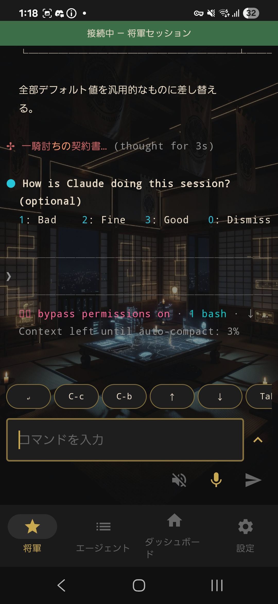
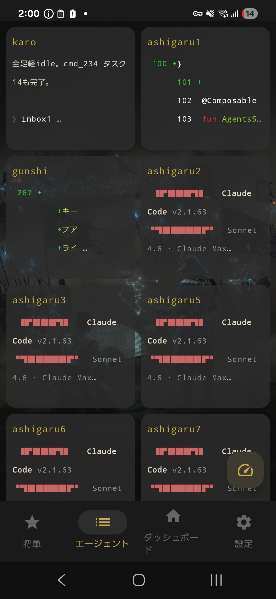
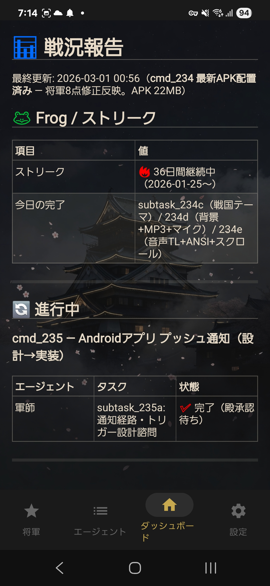
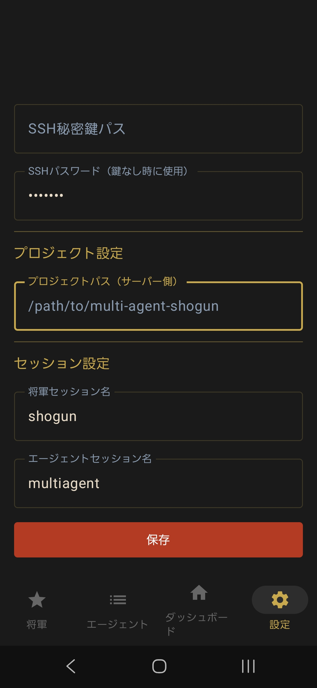
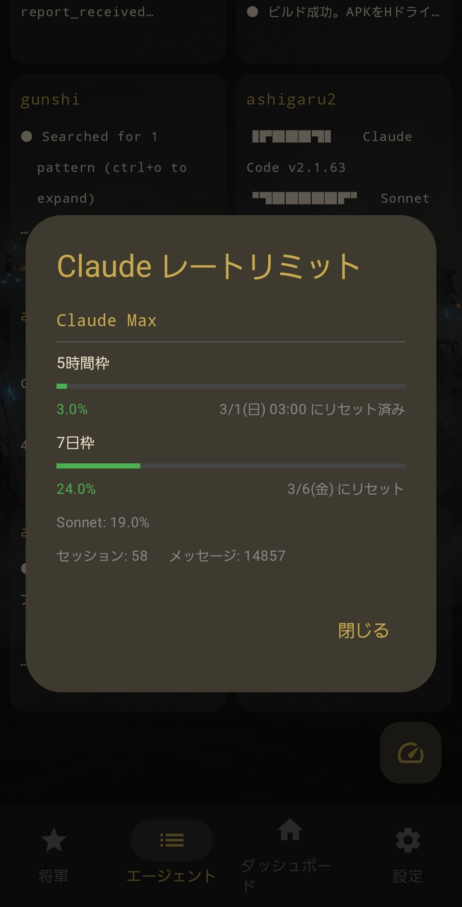

# Shogun Android Companion

Companion app for [multi-agent-shogun](https://github.com/yohey-w/multi-agent-shogun) — monitor and control your AI agent army from your phone.

This fork keeps the upstream UI/UX, but adjusts the connection behavior for this repository's tmux and Android workflow.

<p align="center">
  
  
  
</p>

## Features

### 4-Tab Navigation

| Tab | Function |
|-----|----------|
| **Shogun** | Live SSH terminal to the Shogun pane. Send text/voice commands, view ANSI-colored output with special key bar (Enter, C-c, C-b, arrows, Tab, ESC, etc.) |
| **Agents** | 9-pane grid view (Karo + 7 Ashigaru + Gunshi). Tap to expand fullscreen. Send commands to individual agents. |
| **Dashboard** | Renders `dashboard.md` as HTML with full table text selection and copy support. |
| **Settings** | SSH connection config (host, port, user, key/password), project path, tmux session names. |

### Key Features

- **Voice Input** — Japanese speech recognition with continuous listening mode. Dictate commands hands-free.
- **BGM** — 3 built-in Sengoku-themed tracks (shogun / shogun-reiwa / shogun-ashigirls). Tap to cycle through tracks. Auto-ducks during voice input.
- **Rate Limit Monitor** — Tap the FAB button on the Agents tab to check Claude Max usage (5h/7d windows, Sonnet/Opus breakdown, session/message counts) with visual progress bars.
- **Screenshot Sharing** — Share screenshots from other apps directly to Shogun via Android share sheet. Files are SFTP-transferred to the server.
- **ANSI Color Support** — Terminal output rendered with 256-color ANSI escape code parsing.
- **Special Keys Bar** — Quick access to Enter, C-c, C-b, arrows, Tab, ESC, C-o, C-d for tmux/Claude Code workflow.
- **Auto-Refresh** — Shogun pane (3s), Agents grid (5s) with batched SSH for efficiency.
- **Text Selection** — Long-press to select and copy text in all screens.

<p align="center">
  
  
</p>

## Tech Stack

- **Language**: Kotlin
- **UI**: Jetpack Compose + Material 3
- **SSH**: JSch (mwiede fork) 0.2.21
- **Markdown→HTML**: commonmark-java (GFM tables) → WebView
- **Voice**: Android SpeechRecognizer API (ja-JP)
- **Min SDK**: 26 (Android 8.0) / Target: 34

## Install

Download the pre-built APK from this repository's **GitHub Releases**. Use the asset named `multi-agent-shognate-android-*.apk`.

Or build from source:

```bash
./gradlew assembleDebug
# APK: app/build/outputs/apk/debug/app-debug.apk
# Release APK: app/build/outputs/apk/release/app-release.apk
```

The fork APK is intentionally distinct from the upstream `multi-agent-shogun.apk`. In this repository, the fork APK is the supported distribution.

## Setup

1. Launch the app → **Settings** tab
2. Enter SSH connection info:
   - **Host**: Your server's reachable IP address or hostname
   - **Port**: 2222
   - **User**: Your SSH username
   - **Key Path** or **Password**: Authentication method. In this fork, password auth is the default and key path can stay blank
   - **Project Path**: Server-side path to the project
   - **Session Names**: tmux session names for Shogun and Agents
3. Tap **Save** → switch to **Shogun** tab → auto-connects

### Input examples

- **SSH Port**: `2222`
- **Shogun session**: `shogun`
- **Agents session**: `multiagent`
- **Project Path**: `/path/to/multi-agent-shognate`

All connection fields now start empty so no personal or environment-specific values are prefilled.

### Authentication behavior

- If **Key Path is blank**, the app uses `keyboard-interactive,password`.
- If **Key Path is set**, the app tries public key auth first.
- In this fork, if public key auth fails and a password is present, the app automatically retries with password auth.

### Prerequisites

- SSH server running on the host machine
- tmux sessions already launched via `shutsujin_departure.sh`
- Network connectivity between phone and server over any reachable SSH path

## Architecture

```
Android App
    │
    ├── ShogunScreen ──── ShogunViewModel ──┐
    ├── AgentsScreen ──── AgentsViewModel ──┤── SshManager (singleton)
    ├── DashboardScreen ─ DashboardViewModel┤      │
    └── SettingsScreen                      │   JSch SSH
                                            │      │
                                            └──────┤
                                                   ▼
                                            tmux (WSL2/Linux)
                                                   │
                                            ┌──────┴──────┐
                                            │  capture-pane │ (read)
                                            │  send-keys    │ (write)
                                            └──────────────┘
```

## License

MIT — Same as the parent project.
