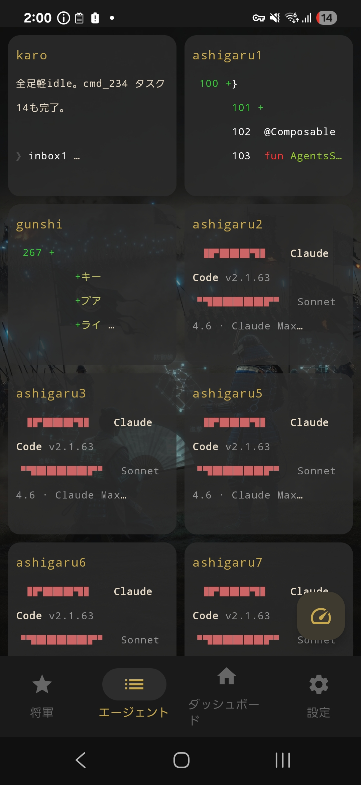
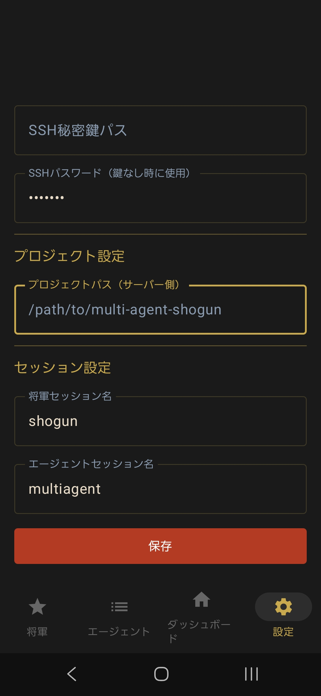

# Shogun Android Companion

Companion app for [multi-agent-shogun](https://github.com/yohey-w/multi-agent-shogun) — monitor and control your AI agent army from your phone.

<p align="center">
  
  
  
</p>

## Features

### 4-Tab Navigation

| Tab | Function |
|-----|----------|
| **Shogun** | Conversation view and RAW log view for the Shogun pane. Send text/voice commands with a special key bar (Enter, C-c, C-b, arrows, Tab, ESC, etc.). |
| **Agents** | 9-pane grid view (Karo + 7 Ashigaru + Gunshi). Tap to expand fullscreen. Send commands to individual agents. |
| **Dashboard** | Renders `dashboard.md` as HTML with full table text selection and copy support. |
| **Settings** | One-touch USB/Tailscale/LAN connection setup. Detailed SSH fields remain available in Manual Mode. |

### Key Features

- **Voice Input** — Japanese speech recognition with continuous listening mode. Dictate commands hands-free.
- **Send Guard** — While the Shogun CLI is `Working`, sending is disabled. If the Shogun pane has unsent composer text, the app cancels that draft before sending the Android-side input.
- **Draft Persistence** — Text being typed in the Shogun tab survives tab changes and display-mode switches.
- **BGM** — 3 built-in Sengoku-themed tracks (shogun / shogun-reiwa / shogun-ashigirls). Tap to cycle through tracks. Auto-ducks during voice input.
- **Rate Limit Monitor** — Tap the FAB button on the Agents tab to check Claude Max usage (5h/7d windows, Sonnet/Opus breakdown, session/message counts) with visual progress bars.
- **Screenshot Sharing** — Share screenshots from other apps directly to Shogun via Android share sheet. Files are SFTP-transferred to the server.
- **ANSI Color Support** — Terminal output rendered with 256-color ANSI escape code parsing.
- **Input Controls** — Expand/send buttons stay on the same row as the input field. Enter, C-c, C-b, arrows, Tab, ESC, C-o, C-d remain available from the special key bar.
- **Auto-Refresh** — Shogun pane (3s), Agents grid (5s) with batched SSH for efficiency.
- **Text Selection** — Long-press to select and copy text in all screens.

<p align="center">
  
  
</p>

## Tech Stack

- **Language**: Kotlin
- **UI**: Jetpack Compose + Material 3
- **SSH**: JSch (mwiede fork) 0.2.21
- **Markdown→HTML**: commonmark-java (GFM tables) → WebView
- **Voice**: Android SpeechRecognizer API (ja-JP)
- **Min SDK**: 26 (Android 8.0) / Target: 34

## Install

Download the latest APK from the GitHub Releases page and sideload it.

Or build from source:

```bash
./gradlew assembleDebug
# APK: app/build/outputs/apk/debug/app-debug.apk
```

## Versioning

The Android APK follows the Shogunate release version plus a fork/app revision. For example, Shogunate `5.2.0` with the first Android-specific revision is `5.2.0.1`.

## Setup

1. Launch the app → **Settings** tab
2. On the host, run one of:
   - Installed package, USB auto + Tailscale/LAN: `cd <project> && shogunate pair`
   - Source checkout helper: `bash android/tools/setup_android_ssh.sh --pair` (`--pair-usb` remains a compatibility alias)
   - Source checkout Tailscale/LAN helper: `bash android/tools/setup_android_ssh.sh --pair-wireless`
   - USB manual value push: `bash android/tools/setup_android_ssh.sh --usb`
   - Wireless candidate display: `bash android/tools/setup_android_ssh.sh --wireless`
   - Windows/WSL: double-click `android/tools/setup_android_ssh.bat`, or run the `.sh` from WSL
3. Shogunate Pair makes the Android app generate its own SSH key in app private storage. The PC receives only the public key and adds it to `authorized_keys` after you confirm the displayed device name and enter the local Pair Password prompt; the private key never leaves the phone.
4. `shogunate pair` uses the current directory as the target project, tries USB `adb reverse`, and keeps Tailscale/LAN listening at the same time. USB pairing uses Android `127.0.0.1:8765` → pairing server and `127.0.0.1:2222` → host SSH. Tailscale/LAN pairing listens on port `8765`; enter a reachable host IP/DNS in the app and tap **接続**.
5. The **接続先** field validates DNS names, URLs, Tailscale IPs, and LAN IPs while you type, then normalizes them to the SSH host/port. URL path/query text is ignored; only host and port are used for SSH.
6. **USB** selects `127.0.0.1:2222`. **無線** restores the previous wireless destination, so enter any reachable Tailscale/LAN/DNS address and tap **接続**. Connecting saves the settings, and the app keeps retrying the same host/port until you change them.
7. Open **マニュアルモード** only when you need to edit detailed values:
   - **Host**: USB uses `127.0.0.1`; wireless uses your Tailscale/LAN IP
   - **Port**: USB uses `2222`; wireless uses the SSH port printed by `setup_android_ssh.sh --wireless` (`22` by default, or another port such as `2223` when WSL is configured that way)
   - **User**: Your SSH username
   - **Key Path** or **Password**: Authentication method
   - **Project Path**: Server-side path to multi-agent-shogun (e.g., `/mnt/c/tools/multi-agent-shogun`)
   - **Shogun target**: default is `agent:shogun`, which auto-detects the pane with `@agent_id=shogun`
   - **Agents target**: default is `shogunate:goza`
8. Tap **接続**. If SSH is not configured yet, the app sends a pairing request to the PC, saves the returned SSH settings after approval, then retries SSH.
9. Once the check passes, switch to the **Shogun** tab → auto-connects to the Shogun pane only. Later connections use the saved SSH key without re-running Shogunate Pair.

### Prerequisites

- SSH server running on the host machine
- tmux sessions already launched via `shogunate_mod/runtime/entrypoint.sh`
- Network connectivity between phone and server: USB debugging + `adb reverse`, LAN, or Tailscale
- `adb` for USB setup
- One-touch key pairing prefers the release-compatible app-side key provider. Older debug APKs without that provider fall back to `run-as`.

## Architecture

```
Android App
    │
    ├── ShogunScreen ──── ShogunViewModel ──┐
    ├── AgentsScreen ──── AgentsViewModel ──┤── SshManager (singleton)
    ├── DashboardScreen ─ DashboardViewModel┤      │
    └── SettingsScreen                      │   JSch SSH
                                            │      │
                                            └──────┤
                                                   ▼
                                            tmux (WSL2/Linux)
                                                   │
                                            ┌──────┴──────┐
                                            │  capture-pane │ (read)
                                            │  send-keys    │ (write)
                                            └──────────────┘
```

## License

MIT — Same as the parent project.
