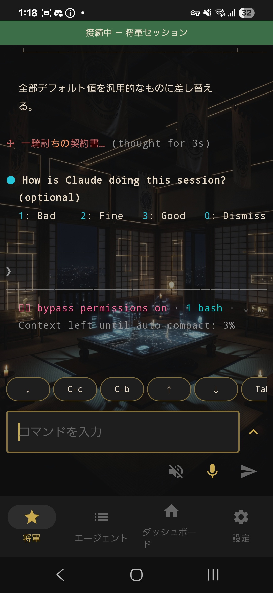
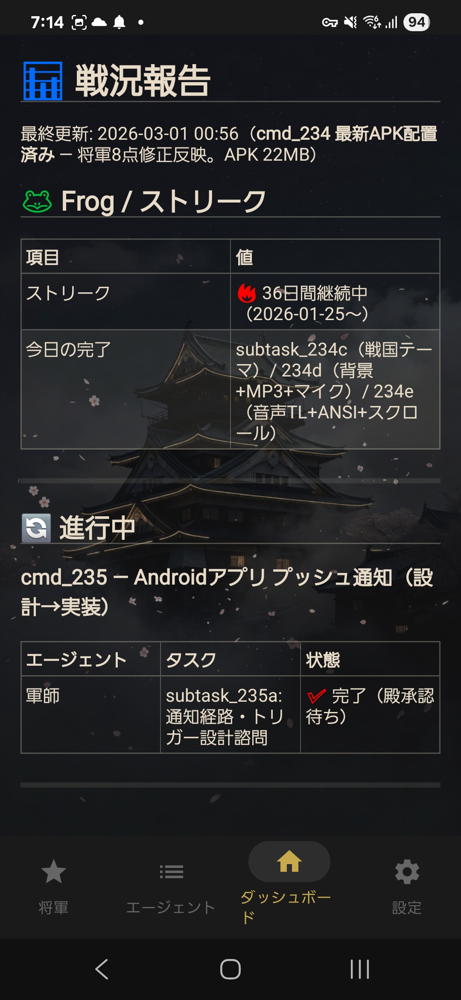
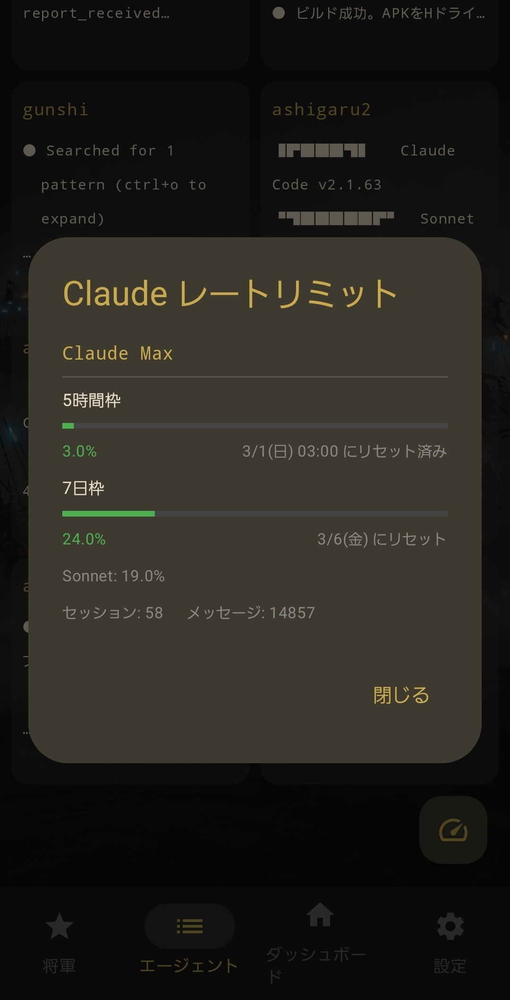

# Shogun Android コンパニオン

[multi-agent-shogun](https://github.com/yohey-w/multi-agent-shogun) のコンパニオンアプリ — スマホからAIエージェント軍団を監視・操作。

<p align="center">
  
  
  
</p>

## 機能

### 4タブ構成

| タブ | 機能 |
|------|------|
| **将軍** | 将軍ペインとの会話表示とRAWログ表示。テキスト/音声でコマンド送信。特殊キーバー（Enter, C-c, C-b, 矢印, Tab, ESC等） |
| **エージェント** | 9ペイン一覧表示（家老 + 足軽7 + 軍師）。タップで全画面展開。個別エージェントへのコマンド送信 |
| **ダッシュボード** | `dashboard.md` をHTML描画。表のテキスト選択・コピー対応 |
| **設定** | USB/Tailscale/LAN のワンタッチ接続設定。従来の SSH 詳細入力はマニュアルモードに格納 |

### 主要機能

- **音声入力** — 日本語音声認識（連続リスニングモード）。ハンズフリーでコマンド入力
- **送信ガード** — 将軍CLIが `Working` 中は送信を止めます。将軍側に未送信テキストが残っている時は、送信時にキャンセルしてからスマホ側の入力を送ります。
- **入力保持** — 将軍タブの入力中テキストは、タブ移動や表示切替をしても保持されます。
- **BGM** — 戦国テーマBGM 3曲内蔵（shogun / shogun-reiwa / shogun-ashigirls）。タップで曲切替。音声入力中は自動ダッキング
- **レートリミットモニター** — エージェントタブのFABボタンからClaude Max使用量を確認（5h/7dウィンドウ、Sonnet/Opus内訳、セッション/メッセージ数）
- **スクリーンショット共有** — 他アプリの共有メニューからShogunへ直接送信。SFTP転送
- **ANSI カラー対応** — 256色ANSIエスケープコード解析によるターミナル出力描画
- **入力操作ボタン** — 入力欄と同じ行に展開/送信ボタンを配置。Enter, C-c, C-b, 矢印, Tab, ESC, C-o, C-d は特殊キーバーから送信
- **自動リフレッシュ** — 将軍ペイン（3秒）、エージェント一覧（5秒）。SSH一括取得で効率化
- **テキスト選択** — 全画面で長押しによるテキスト選択・コピー対応

<p align="center">
  
  
</p>

## 技術スタック

- **言語**: Kotlin
- **UI**: Jetpack Compose + Material 3
- **SSH**: JSch (mwiede fork) 0.2.21
- **Markdown→HTML**: commonmark-java (GFM tables) → WebView
- **音声**: Android SpeechRecognizer API (ja-JP)
- **Min SDK**: 26 (Android 8.0) / Target: 34

## インストール

GitHub Releases の最新 APK をダウンロードしてサイドロードします。

またはソースからビルド:

```bash
./gradlew assembleDebug
# APK: app/build/outputs/apk/debug/app-debug.apk
```

## バージョン

Android APK は Shogunate 本体のリリースバージョンに fork/app 側の改訂番号を足します。例: Shogunate `5.2.0` に対する Android 側の最初の改訂は `5.2.0.1` です。

## セットアップ

1. アプリを起動 → **設定** タブ
2. ホスト側で以下のどれかを実行:
   - package 導入済み、USB auto + Tailscale/LAN: `cd <project> && shogunate pair`
   - source checkout helper: `bash android/tools/setup_android_ssh.sh --pair`（`--pair-usb` は互換 alias）
   - source checkout Tailscale/LAN helper: `bash android/tools/setup_android_ssh.sh --pair-wireless`
   - USB手動値送信: `bash android/tools/setup_android_ssh.sh --usb`
   - 無線候補表示: `bash android/tools/setup_android_ssh.sh --wireless`
   - Windows/WSL: `android/tools/setup_android_ssh.bat` をダブルクリック、または WSL から `.sh` を実行
3. Shogunate Pair では、Android app が app 内に専用 SSH 鍵を生成します。PC 側は公開鍵だけを受け取り、表示された端末名を確認して Pair Password prompt に入力した場合だけ `authorized_keys` に登録します。秘密鍵はスマホの app private storage から出しません。
4. `shogunate pair` は現在の directory を target project として使い、USB `adb reverse` を試しながら、同時に Tailscale/LAN でも待ち受けます。USB pairing は Android `127.0.0.1:8765` → pairing server、`127.0.0.1:2222` → host SSH を使います。Tailscale/LAN pairing は port `8765` で待ち受けるため、app 側に到達可能な IP/DNS を入れて **接続** を押します。
5. 設定画面の **接続先** は入力中に DNS 名、URL、Tailscale IP、LAN IP を SSH 用 host/port へ正規化します。URL の path/query は無視され、host と port だけが SSH 接続に使われます。
6. **USB** は `127.0.0.1:2222` を選びます。**無線** は前回の無線接続先を復元するため、Tailscale / LAN / DNS のどれでも到達できるアドレスを入れて **接続** を押します。接続すると設定を保存し、設定が変わるまで同じ host/port で再接続を試みます。
7. 手動で細かく設定したい場合だけ **マニュアルモード** を開きます:
   - **ホスト**: USB は `127.0.0.1`、無線は Tailscale / LAN IP
   - **ポート**: USB は `2222`、無線は `setup_android_ssh.sh --wireless` が表示した SSH ポート（通常は `22`、WSL で変更している場合は `2223` など）
   - **ユーザー**: SSHユーザー名
   - **鍵パス** または **パスワード**: 認証方式
   - **プロジェクトパス**: サーバー側のmulti-agent-shogunパス（例: `/mnt/c/tools/multi-agent-shogun`）
   - **将軍 target**: 標準は `agent:shogun`。`@agent_id=shogun` の pane を自動検出します。
   - **エージェント target**: 標準は `shogunate:goza`
8. **接続** を押します。SSH 未設定なら app が PC へ pairing request を送り、承認後に返却された SSH 設定を保存して同じ操作内で再接続します。
9. 診断が通ったら **将軍** タブに切替 → 将軍 pane のみに自動接続。以後は保存済み SSH 鍵で、Shogunate Pair を再実行せず接続できます。

### 前提条件

- ホストマシンでSSHサーバーが稼働中
- `shutsujin_departure.sh` でtmuxセッション起動済み
- スマホとサーバー間の接続（USBデバッグ + `adb reverse`、LAN、Tailscale等）
- USB 接続を使う場合は `adb`
- ワンタッチ鍵ペアリングは release APK でも使える app 内鍵生成 provider を優先します。古い debug APK で provider がない場合だけ `run-as` fallback を使います。

## アーキテクチャ

```
Android App
    │
    ├── ShogunScreen ──── ShogunViewModel ──┐
    ├── AgentsScreen ──── AgentsViewModel ──┤── SshManager (singleton)
    ├── DashboardScreen ─ DashboardViewModel┤      │
    └── SettingsScreen                      │   JSch SSH
                                            │      │
                                            └──────┤
                                                   ▼
                                            tmux (WSL2/Linux)
                                                   │
                                            ┌──────┴──────┐
                                            │  capture-pane │ (read)
                                            │  send-keys    │ (write)
                                            └──────────────┘
```

## ライセンス

MIT — 親プロジェクトと同じ。
